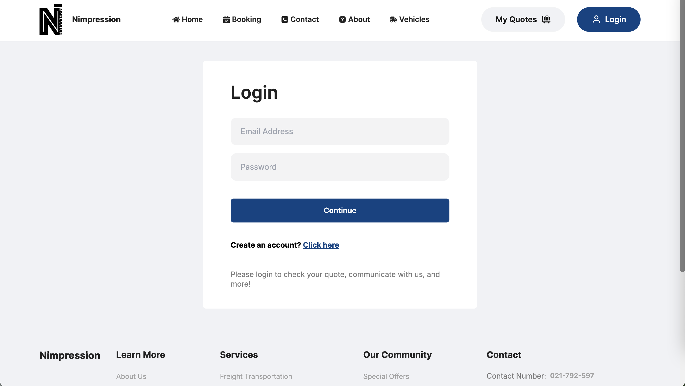
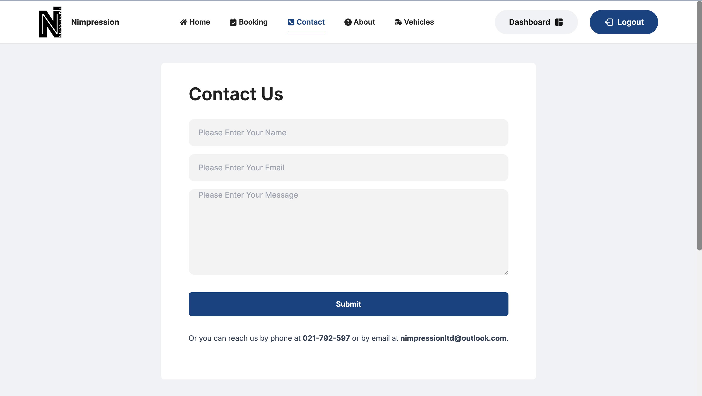

# Nimpression - Company Website
## Description
This repository showcases part of my current internship project, a full-stack web application for Nimpression Ltd., a logistics company. The app enables customers to learn about the company, obtain quotes, and track deliveries. It also assists managers in managing trucks and communicating with customers.

## Key Features (so far)
### 1. User-Friendly Homepage:


### 2. Manager Dashboard:
Custom dashboards for each user role with tailored functionality.


### 3. Login/Register:
Multi-steps register with comprehensive validation.



### 4. Getting Quotes and Make a booking: 

Staff can manage the quotes they receieve and respond to them.

### 5. Messaging System: 
Enables communication between customers and staff/manager.


### 6. Track delivery:


## Project Layout
```bash
admin
   |-- .gitignore
   |-- README.md
   |-- eslint.config.js
   |-- index.html
   |-- package-lock.json
   |-- package.json
   |-- postcss.config.js
   |-- public
   |   |-- logo.svg
   |-- src
   |   |-- App.jsx
   |   |-- assets
   |   |   |-- logo.svg
   |   |   |-- profile.png
   |   |   |-- react.svg
   |   |   |-- upload_area.png
   |   |-- components
   |   |   |-- AddTruck.jsx
   |   |   |-- EditTruck.jsx
   |   |   |-- ListTruck.jsx
   |   |   |-- Navbar.jsx
   |   |   |-- Sidebar.jsx
   |   |-- index.css
   |   |-- main.jsx
   |   |-- pages
   |   |   |-- Admin.jsx
   |-- tailwind.config.js
   |-- vite.config.js
backend
   |-- index.js
   |-- node_modules
   |-- package-lock.json
   |-- package.json
   |-- upload
   |   |-- images
frontend
   |-- .eslintrc.cjs
   |-- .gitignore
   |-- README.md
   |-- index.html
   |-- package-lock.json
   |-- package.json
   |-- postcss.config.js
   |-- public
   |   |-- logo.svg
   |-- src
   |   |-- App.jsx
   |   |-- Context
   |   |   |-- CompanyContext.jsx
   |   |-- assets
   |   |   |-- all_products.js
   |   |   |-- footer_contact.js
   |   |   |-- footer_links.js
   |   |   |-- logo.svg
   |   |   |-- popular.js
   |   |   |-- value.js
   |   |-- components
   |   |   |-- AboutUs.jsx
   |   |   |-- CartItems.jsx
   |   |   |-- ContactUs.jsx
   |   |   |-- Footer.jsx
   |   |   |-- Header.jsx
   |   |   |-- Hero.jsx
   |   |   |-- Item.jsx
   |   |   |-- Navbar.jsx
   |   |   |-- Newsletter.jsx
   |   |   |-- Offer.jsx
   |   |   |-- Popular.jsx
   |   |   |-- ProductDisplay.jsx
   |   |   |-- ProductHd.jsx
   |   |   |-- Team.jsx
   |   |   |-- Trucks.jsx
   |   |   |-- Value.jsx
   |   |-- index.css
   |   |-- main.jsx
   |   |-- pages
   |   |   |-- About.jsx
   |   |   |-- Booking.jsx
   |   |   |-- Cart.jsx
   |   |   |-- Contact.jsx
   |   |   |-- Home.jsx
   |   |   |-- Login.jsx
   |   |   |-- Track.jsx
   |   |   |-- Truck.jsx
   |   |   |-- Vehicles.jsx
   |-- tailwind.config.js
   |-- vite.config.js

```
## Project Links
- GitHub: https://github.com/LUMasterOfAppliedComputing2024S1/COMP639S1_Project_2_Group_I](https://github.com/Sijia-Hu-1158997/nimpression
