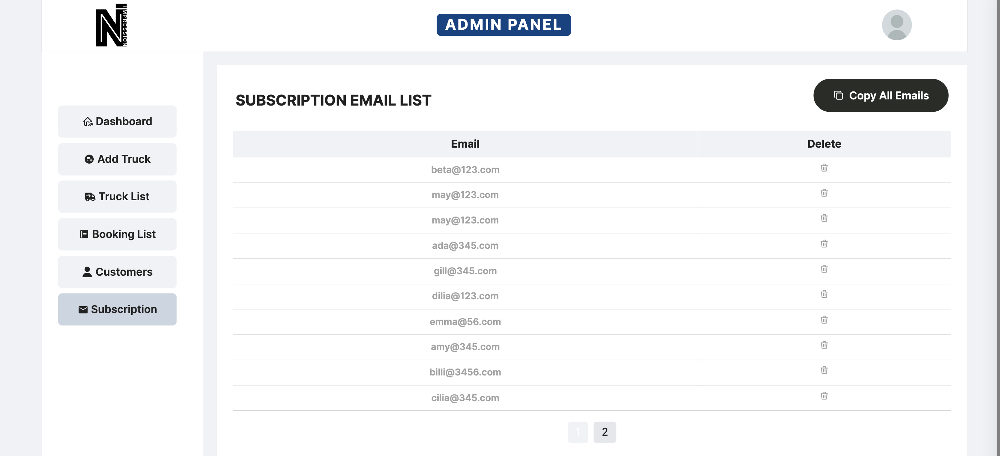

# Nimpression - Company Website
## Description
This repository showcases part of my current internship project: a full-stack web application for Nimpression Ltd., a logistics company. The app allows customers to learn about the company, obtain quotes, and track deliveries. It also helps managers manage trucks and communicate with customers.

The web app employs modular coding practices to make the code more reusable. It integrates the Google Places API for address autocomplete, and I am currently working on integrating the Distance Matrix API to calculate booking prices.

## Design


## Key Features:
### 1. Deployment:
 - Platform: Deployed on AWS EC2 instances.
 - Route 53: Manages DNS routing.
 - AWS Certificate Manager: Provides SSL certificates for secure connections.
 - CloudFront Distribution: Ensures efficient content delivery across different regions.

### 2. User-Friendly Homepage that adapts to different screen sizes:


### 3. Manager Dashboard:
Custom dashboard for admin with tailored functionality.


### 4. Getting Quotes and Make a booking with API Integration:
(Use Places API to autocomplete address and Distance Matrix API for calculating booking fee.)


For admin, there are comprehensive filter for searching. 


For customer to manage their booking:


### 5. Subscription:
Easy subscription management for admin. A button to copy all emails addresses in bulk for mass communication (e.g., in "email1; email2" format)



### 6. Role Access: 
Secure access for admin function.


### 7. Cnotact: 
Use FormCarry API to collect user queries and send to admin's email.


## Project Layout
```bash
-- docker-compose.yml
admin
   |-- Dockerfile
   |-- index.html
   |-- src
   |   |-- App.jsx
   |   |-- components
   |   |   |-- AddTruck.jsx
   |   |   |-- EditBooking.jsx
   |   |   |-- EditTruck.jsx
   |   |   |-- ListBooking.jsx
   |   |   |-- ListTruck.jsx
   |   |   |-- Navbar.jsx
   |   |   |-- Sidebar.jsx
   |   |-- index.css
   |   |-- main.jsx
   |   |-- pages
   |   |   |-- Admin.jsx
backend
   |-- Dockerfile
   |-- index.js
   |-- models
   |   |-- Booking.js
   |   |-- Truck.js
   |   |-- User.js
   |-- routes
   |   |-- bookings.js
   |   |-- places.js
   |   |-- trucks.js
   |   |-- users.js
frontend
   |-- Dockerfile
   |-- index.html
   |-- public
   |   |-- logo.svg
   |-- src
   |   |-- App.jsx
   |   |-- Context
   |   |   |-- CompanyContext.jsx
   |   |-- components
   |   |   |-- AboutUs.jsx
   |   |   |-- CartItems.jsx
   |   |   |-- ContactUs.jsx
   |   |   |-- Footer.jsx
   |   |   |-- Header.jsx
   |   |   |-- Hero.jsx
   |   |   |-- Item.jsx
   |   |   |-- Navbar.jsx
   |   |   |-- Newsletter.jsx
   |   |   |-- Offer.jsx
   |   |   |-- Popular.jsx
   |   |   |-- ProductDisplay.jsx
   |   |   |-- ProductHd.jsx
   |   |   |-- Team.jsx
   |   |   |-- Trucks.jsx
   |   |   |-- Value.jsx
   |   |-- index.css
   |   |-- main.jsx
   |   |-- pages
   |   |   |-- About.jsx
   |   |   |-- AddBooking.jsx
   |   |   |-- Cart.jsx
   |   |   |-- Contact.jsx
   |   |   |-- Home.jsx
   |   |   |-- Login.jsx
   |   |   |-- Track.jsx
   |   |   |-- Truck.jsx
   |   |   |-- Vehicles.jsx
nginx-config
   |-- Dcokerfile
   |-- nginx.conf
   |-- wait-for-it.sh
   |-- site_enabled
   |   |-- nimpression.conf
```
## Project Links
- GitHub: https://github.com/Sijia-Hu-1158997/nimpression

## More Photos:
### Home Page: 


### Admin
Manager users


Manager trucks


